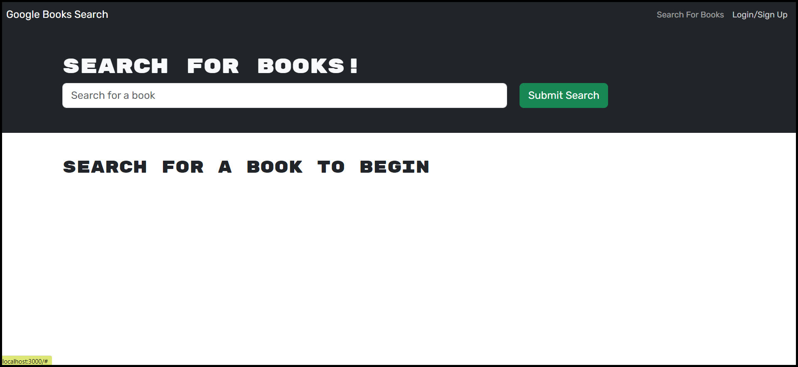
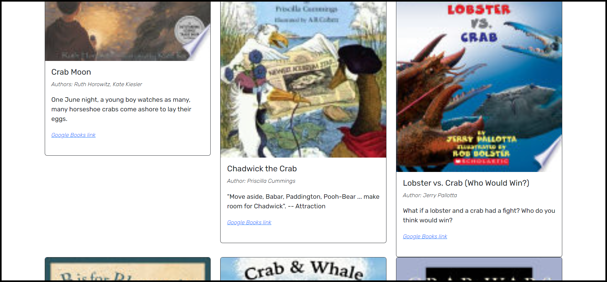
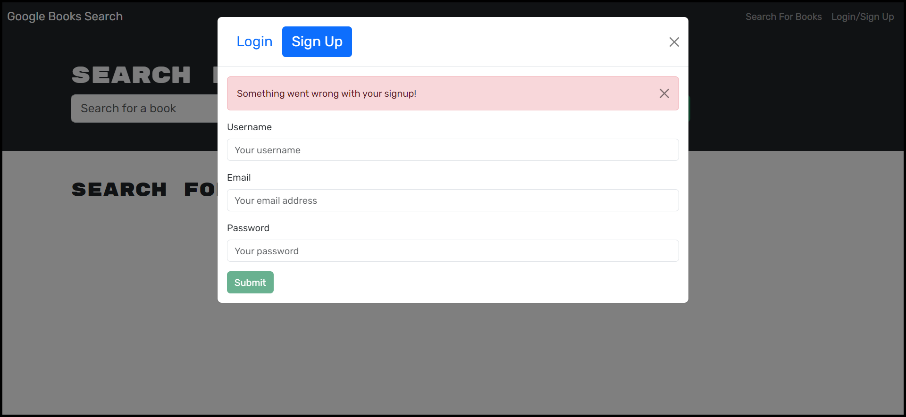
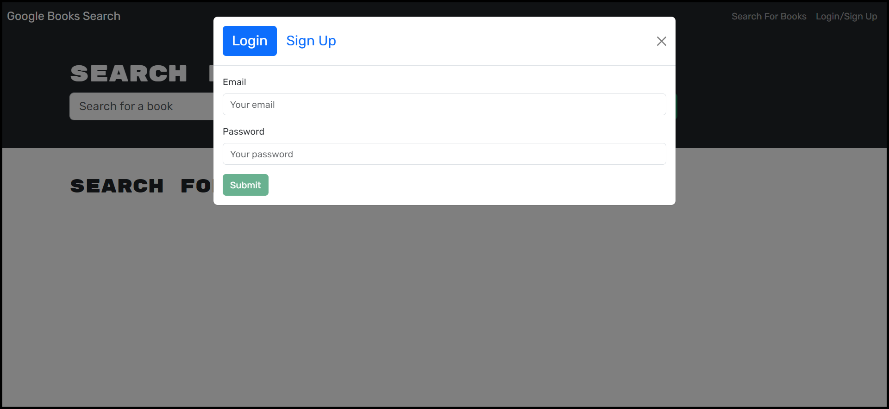
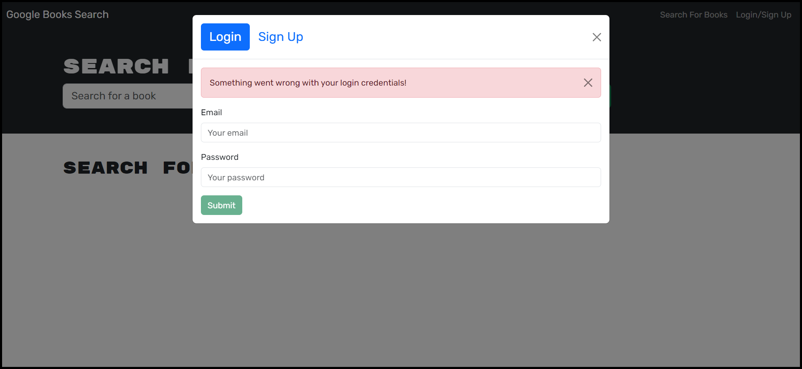
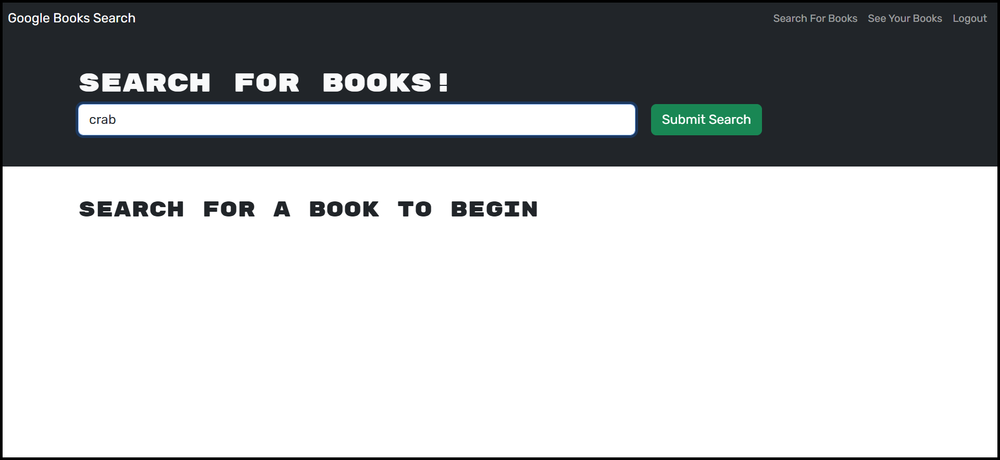
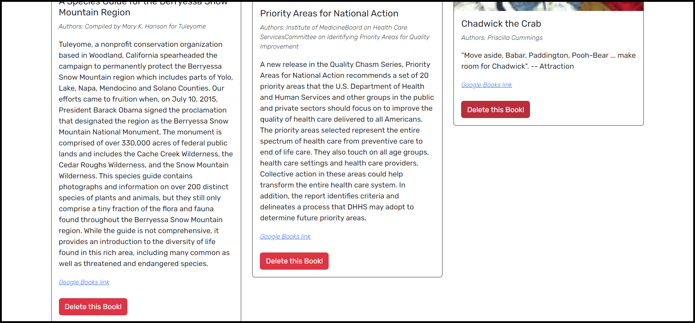
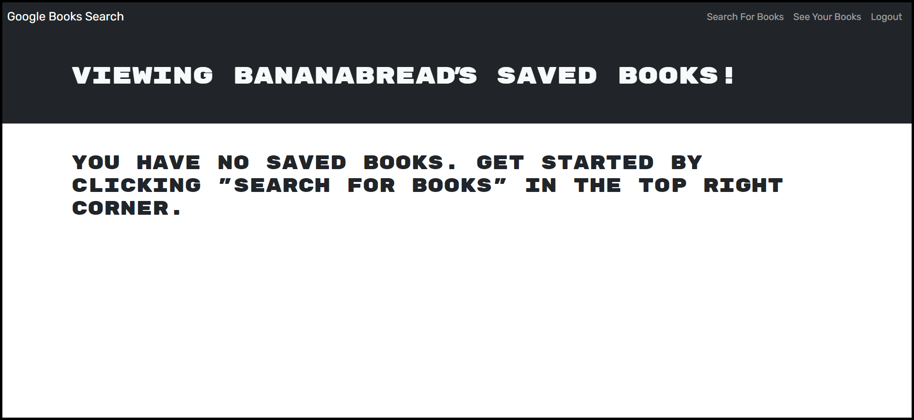

# Challenge 21: Personalized Book Search Engine with GraphQL

## Description
Books are important, as they play a significant role in bringing worlds to life or explaining important information. For example, you can follow characters through a fantasy world filled with magical creatures, or you can consult a cookbook for recipes that can help you make dinner for your family. However, it can be difficult to find the right place to look, and many people would benefit from a resource that lets them search for books by topic.

This app allows users to create an account, and once they are logged in, they can search for books by keyword, save them, acquire them through their Google Books links, and delete them once they are no longer needed. This project taught me how to write and connect typeDefs and resolvers, handle queries and mutations on the front end and the back end, and import specific libraries from packages.

## Table of Contents
- [Description](#description)
- [Installation](#installation)
- [Usage](#usage)
- [Credits](#credits)
- [Contributing](#contributing)
- [Tests](#tests)
- [License](#license)
- [Questions](#questions)

## Installation
No installation is required for this project.

## Usage
At the home page, the options in the header are `Search For Books` and `Login/Sign Up`.

You can search for books when you are not logged in, but you will not be able to save them.

If you do not have an existing account, or you would like to create a new one, click on `Login/Sign Up` in the top right corner and set the toggle to `Sign Up`.

If your inputs are invalid, such as an improperly formatted email address, you will see the error message `Something went wrong with your signup!`.

Logging in works in a similar manner.

**Login form:**

**Invalid input:**

If your credentials are valid, you will be taken to the home page, where the header options become `Search For Books`, `See Your Books`, and `Logout`.

This time, the books that you search for will have a save button. If you click a save button, the text will change to `This book has already been saved!` and the button will no longer be clickable.

Once you have saved at least one book, you can click on `See Your Books` in the top right corner. You will be able to view all your saved books and delete them once you no longer need them.

**Note:** If you do not have any saved books, the saved books page will display this message:

The deployed application can be found [here](https://personalized-book-search-app-c1a85de82eb6.herokuapp.com/).

## Credits
Received assistance in the *#02-ask-the-class* Slack channel from students Michael Taraschi, Avery Myers, and Mark Thostesen; TA Michael Seaman; and instructor Robbert Wijtman. Also received help from the following AskBCS assistants:

1. Alex
2. Mampuru
3. Adriane
4. Zack
5. Diego
6. Chris
7. John
8. Joem

The following web resources helped me write the code for this project:

1. [The split() method](https://developer.mozilla.org/en-US/docs/Web/JavaScript/Reference/Global_Objects/String/split)
2. [The pop() method](https://developer.mozilla.org/en-US/docs/Web/JavaScript/Reference/Global_Objects/Array/pop)
3. [The trim() method](https://developer.mozilla.org/en-US/docs/Web/JavaScript/Reference/Global_Objects/String/trim)
4. [Stack Overflow: Field must have a selection of subfields](https://stackoverflow.com/questions/46111514/field-me-of-type-user-must-have-a-selection-of-subfields)
5. [Optional chaining](https://developer.mozilla.org/en-US/docs/Web/JavaScript/Reference/Operators/Optional_chaining)
6. [The join() method](https://www.geeksforgeeks.org/create-a-comma-separated-list-from-an-array-in-javascript/)
7. [How to make an anchor tag open a link in a new tab](https://www.freecodecamp.org/news/how-to-open-a-link-in-a-new-tab/)
8. [How to use refetchQueries](https://www.apollographql.com/docs/react/data/mutations/#refetching-queries)

## Contributing
This application currently does not have safeguards to ensure that the user creates a strong enough password when they sign up. You can make your password `a` and it will be accepted as long as your username and email are valid. If someone could help me implement password strength verification, I would greatly appreciate it.

## Tests
No tests have been written for this application.

## License
No license is attached to this repository.

## Questions
If you have any questions for me, you can [follow me on GitHub](https://github.com/GimmeKitties711) or email me at eric20wang.wang@gmail.com.
